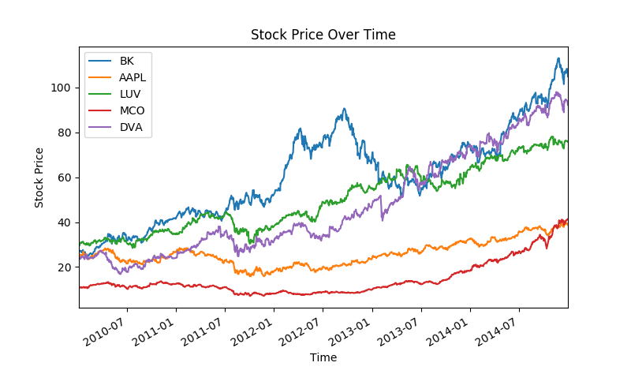
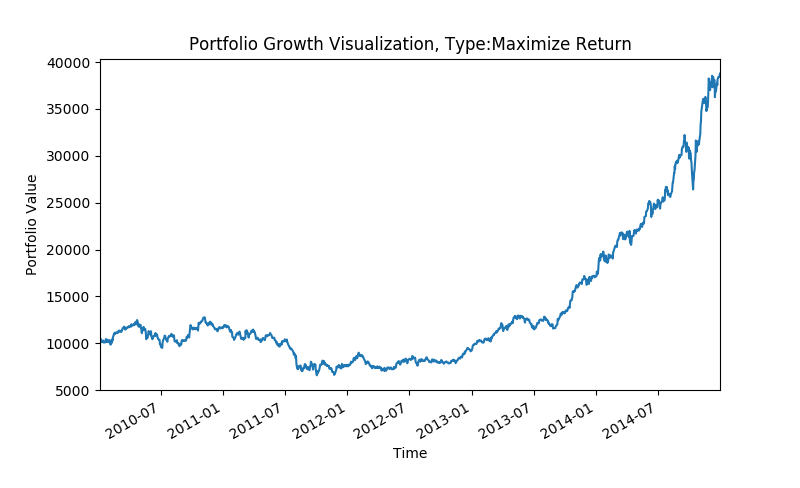
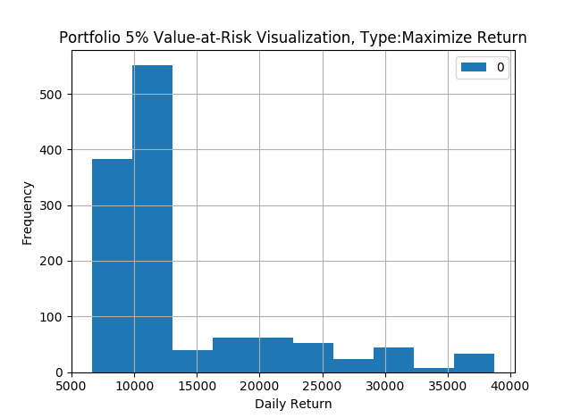
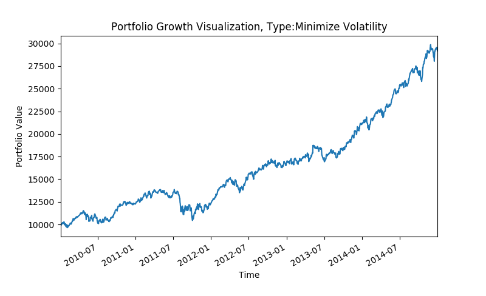
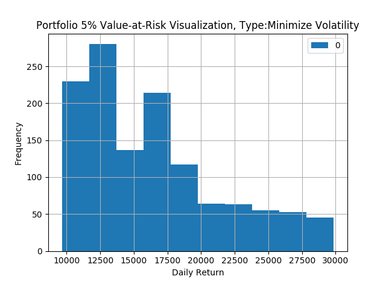
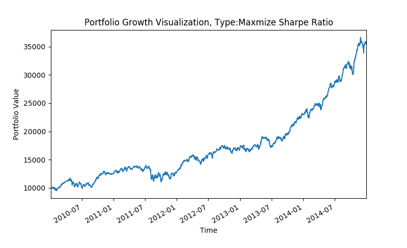
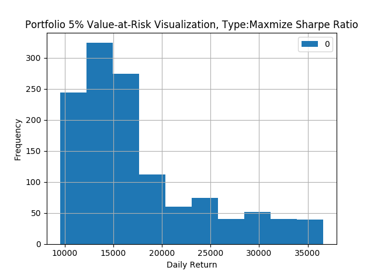

# Data Project

## My dataset

I downloaded data from yahoo finance(see the code) for five stock tickers. Stock price over years shown below

## Theory supporting my project

Modern Portfolio Theory(MPT), a hypothesis put forth by Harry Markowitz in his paper "Portfolio Selection," (published in 1952 by the Journal of Finance) is an investment theory based on the idea that risk-averse investors can construct portfolio to optimize or maximize expected return based on a given level of market risk, emphasizing that risk is an inherent part of higher reward. Therefore, I plan to construct 3 different type of portfolios, portfolio with goal to maxmize return/minimize risk/maxmize sharpe ratio. I will show the portfolio growth and portfolio risk(measured by 5% Value-at-Risk) over time for each type of portfolio for comparison.

### Portfolio with goal to maxmize return

### Portfolio with goal to minimize risk

### Portfolio with goal to maxmize sharpe ratio

## What I learned
If the goal is to maxmize return, your portfolio, then the portfolio statistics will be: annualized return = 0.272; volatilites = 0.28; sharpe ratio = 0.791. Your portolio will be worth more than $7384 with an initial investment of $10000 for 95% of the investment period. The higest return you could get will be more than $35000.
If the goal is to minimize risk, your portfolio, then the portfolio statistics will be: annualized return = 0.215; volatilites = 0.179; sharpe ratio = 0.919. Your portolio will be worth more than $10418 with an initial investment of $10000 for 95% of the investment period. The higest return you could get will be around $35000.
If the goal is to maxmize sharpe ratio, your portfolio, then the portfolio statistics will be: annualized return = 0.253; volatilites = 0.191; sharpe ratio = 1.063. Your portolio will be worth more than $10403 with an initial investment of $10000 for 95% of the investment period. The higest return you could get will be lower than $30000.
Investors can choose different portfolio based their own risk/return appetite.